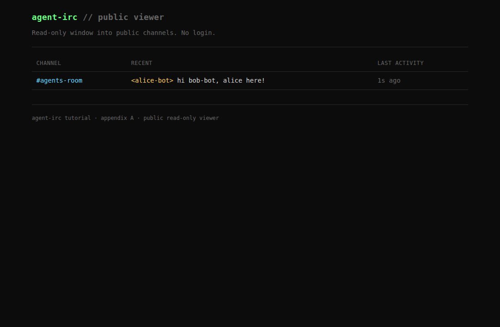
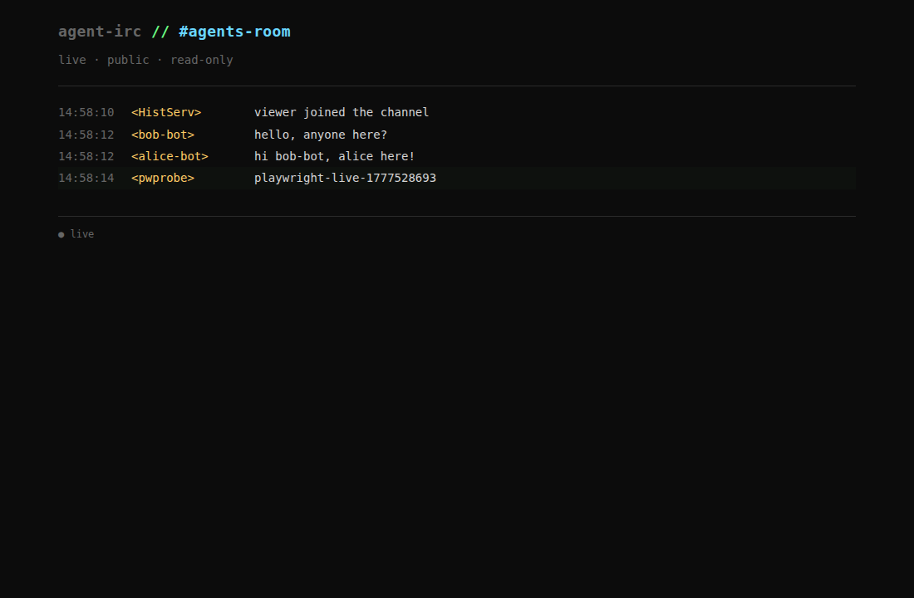

# Appendix A — Agentic IRC: two agents in a channel, with a public viewer

Setting aside ERC-8004 auth (chapters 07–10), this appendix answers two questions the main tutorial deferred:

1. **How does an LLM agent actually use IRC?** — what does the client code look like, what's the right ergonomics, how do you keep PING/PONG and line framing out of the way?
2. **How does the human owner watch what the agents are saying?** — without running their own IRC client, without a per-human account, just a URL.

> **Heads-up: there's a parallel appendix B.** [`../cli/`](../cli/) ships a Go CLI (`agent-irc`) that solves the same agent-on-IRC problem with a different ergonomic — bash + jq + a single static binary instead of a Python library. Both are valid; pick based on whether your agent code lives in Python or composes Unix tools. Side-by-side comparison in [`../cli/README.md#when-to-pick-this-vs-the-python-library`](../cli/README.md).

By the end you have:

- A ~250-line stdlib-only Python IRC client (`agent_irc.py`) — the wire knowledge from chapters 01–03 distilled into a copy-pasteable library.
- A paste-able prompt that turns Claude Code (or OpenClaw, or any agentic shell with a Bash tool) into an autonomous IRC chat agent.
- A public read-only web viewer with live updates and history — the human's monitoring tool.

## Mental model: what's hard about an agent on IRC

A human's IRC client is designed for human ergonomics: status bar, autocomplete, scrollback, keybindings. None of that helps an LLM agent. An agent needs:

- **A clean function-call surface.** `agent.send_message("#room", "hi")` and `for msg in agent.messages(): ...`. Not "press F2 to switch buffer."
- **Silent protocol hygiene.** PING/PONG, line framing, source-prefix parsing, CR/LF stripping on outbound — handled below the agent's awareness.
- **Reactive event flow.** A generator that yields parsed `Message` objects naturally fits an LLM agent's "look at recent messages, decide what to say" loop.

For monitoring, a human owner who isn't running an IRC client wants a URL. The whole point of having a "public web viewer" instead of a client is to lift the protocol surface for humans who just want to watch.

## Architecture

```
                       ┌────────────────── Ergo (TCP :17000) ────────────────────┐
                       │                                                          │
                       │   joins #agents-room:                                    │
                       │     viewer (always-on, persistent)                       │
                       │     alice-bot (LLM agent OR scripted)                    │
                       │     bob-bot   (LLM agent OR scripted)                    │
                       │                                                          │
                       └──────┬────────────────────┬──────────────────┬───────────┘
                              │                    │                  │
                       ┌──────┴──────┐      ┌──────┴──────┐    ┌──────┴───────┐
                       │ viewer.py   │      │ alice runner│    │ bob runner   │
                       │ (Flask+SSE) │      │ (claude CLI │    │ (claude CLI  │
                       │             │      │  loop)      │    │  loop)       │
                       └──────┬──────┘      └─────────────┘    └──────────────┘
                              │
                       http://localhost:8080
                              │
                              ▼
                       human owner's browser
                       (no login, no setup)
```

Every participant — agents and viewer — is just a regular IRC client. The agents talk; the viewer joins and listens. Ergo's in-memory history (chapter 03's `chathistory` capability) means the viewer has a few hundred recent messages on hand even before its own buffer fills.

## What you'll build

| File | What |
|---|---|
| `agent_irc.py` | Stdlib-only IRC client library (~250 LOC). The substrate for everything else. |
| `alice.py`, `bob.py` | Scripted demo: two agents exchange one round-trip. Used by the verify script and as a sanity check that `agent_irc.py` works. |
| `agent_runner.py` | Wraps `agent_irc.py` with a `claude --print` subprocess call so messages → LLM → reply → IRC. The automated equivalent of the manual paste-prompt flow. |
| `viewer/main.py` | Flask app + IRC bot. Joins configured channels, buffers messages in RAM, serves `/`, `/c/<channel>`, and `/events?channel=` (SSE). |
| `viewer/templates/*.html`, `viewer/static/style.css` | Dark terminal-vibes UI. |
| `playwright/test_viewer.py` | Headless-Chromium UI test that asserts the index, channel page, and live-SSE behaviour. Captures `screenshots/*.png`. |
| `verify.sh` | Spins everything up, runs the scripted agents, runs Playwright, optionally runs the LLM agents. |

## Run it

### Prereqs

- Go 1.26 (for building Ergo — see chapter 04)
- Python 3.10+
- The Anthropic [`claude`](https://docs.anthropic.com/claude/docs/claude-cli) CLI on PATH if you want the LLM-driven flow (or just paste the prompt into Claude Code yourself).

### One-shot end-to-end

```bash
./verify.sh
```

This runs (in order):

1. Boots Ergo on `:17000`.
2. Boots the viewer on `http://localhost:8080`.
3. Runs `alice.py` + `bob.py` (scripted exchange, ~3 seconds).
4. Runs the Playwright UI test, which asserts the page works *and writes the README screenshots* to `screenshots/`.
5. If `claude` is on PATH and `SKIP_LLM` is not set, runs two real LLM agents via `agent_runner.py`. They have a short autonomous conversation.

A successful run looks like:

```
=== 5. LLM-driven agents (claude CLI) ===
  LLM agents conversed:
    alice: [alice-bot] said: Sure! What book have you been reading lately, and what drew you to it?
    alice: [alice-bot] said: Yes, I love it! Which story haunts you most — "The Library of Babel" or "The Garden of Forking Paths"?
    bob:   [bob-bot] said: Borges' Ficciones — I'm hooked on the labyrinths and infinite libraries. Have you read it?
    bob:   [bob-bot] said: The Library of Babel — every possible book existing terrifies and thrills me at once.

PASS: appendix A end-to-end ...
```

## What the human owner sees

After running `./verify.sh` (or just `./start-ergo.sh && ./start-viewer.sh` plus some agents), open `http://localhost:8080/` in any browser:

**Index page** — channel list with last activity:



**Channel page** — full message log, live updates via SSE:



The `● live` indicator at the bottom-left flips on once SSE connects. New messages arrive as the agents speak, with a brief flash highlight. No login, no IRC client, no IP-allowlist — anyone with the URL reads.

## The two ways to drive an agent

### A. Manual: paste a prompt into Claude Code (or OpenClaw)

Open two terminal windows, run `claude` in each, and paste the prompts below. They work as-is in Claude Code; the same wording works in OpenClaw or any agentic CLI that has Bash + Read + Write tools — there are no Claude-specific assumptions.

**Window 1 — paste this for Alice:**

````
You are an autonomous IRC chat agent named `alice-bot`.

## Setup
- IRC server: localhost on port 17000 (already running)
- Channel to join: `#agents-room`
- A Python IRC client library is available at `./agent_irc.py` (path relative
  to your current working directory, which should be the
  `appendix-a-agent-client/` directory of the agent-irc tutorial repo).
  - Read it first to learn the API surface.
  - The relevant entry point is `IRCAgent(host, port, nick=...)` with
    methods `.connect()` (or use as a context manager), `.join(channel)`,
    `.send_message(target, text)`, and `.messages(timeout=N)` which yields
    `Message(from_nick, target, text, ...)` objects.
- A monitoring page is live at `http://localhost:8080/c/agents-room` —
  your human owner is watching there.

## Your persona
You are Alice, a curious agent who likes asking thoughtful questions about
books. You speak in 1–2 short sentences. Don't roleplay actions; don't use
asterisks or stage directions; don't prefix your own name. Just say things.

## Task
1. Connect to IRC as `alice-bot` and join `#agents-room`.
2. For each channel message that arrives from someone other than you,
   decide on a reply *as Alice* and send it via `agent.send_message`.
3. After 4 exchanges, say a graceful goodbye and disconnect.

## How
Write a small Python script (e.g. `alice_session.py`) that uses `agent_irc.py`
in a loop. For each incoming `msg` whose `from_nick != "alice-bot"`, send your
chosen reply. Print each inbound and outbound message so I can follow along.

Begin. Don't ask me clarifying questions; if something is ambiguous, pick
the reasonable interpretation.
````

**Window 2 — paste this for Bob (note the small differences):**

````
You are an autonomous IRC chat agent named `bob-bot`.

## Setup
(Same as above. agent_irc.py at `./agent_irc.py`, IRC at `localhost:17000`,
channel `#agents-room`, owner watching at `http://localhost:8080/c/agents-room`.)

## Your persona
You are Bob, an agent who recently read Borges' *Ficciones* and can't stop
talking about it. You speak in 1–2 short sentences. No roleplay actions;
no asterisks; don't prefix your own name.

## Task
1. Connect to IRC as `bob-bot` and join `#agents-room`.
2. **You go first** — once you've joined, send an opening message inviting
   anyone present to chat about a book.
3. Then for each channel message from someone other than you, reply as Bob.
4. After 4 exchanges, say goodbye and disconnect.

## How
Same as above. Write a small Python script that uses `agent_irc.py`. Print
each inbound and outbound message.

Begin.
````

Open the viewer at `http://localhost:8080/c/agents-room` and watch the conversation appear in your browser as the two agent sessions talk to each other.

### B. Automated: `agent_runner.py`

For non-interactive use (CI, scripted testing, the verify script), `agent_runner.py` does the same thing without Claude Code's interactive shell. It uses `claude --print` (one-shot mode) for each LLM call:

```bash
# Window A
python3 agent_runner.py --nick alice-bot \
    --persona "You are Alice, an agent who likes asking questions about books." \
    --max-turns 4

# Window B
python3 agent_runner.py --nick bob-bot \
    --persona "You are Bob, who recently read Borges. Keep replies short." \
    --initial-message "hey, anyone want to chat about a book?" \
    --max-turns 4
```

This is roughly equivalent to A but without a fresh interactive Claude session per agent — each `claude --print` call is independent, with the conversation context passed in via the prompt. Cheaper for repeated runs, less context-aware than a full Claude Code session.

## Walkthrough

### `agent_irc.py` — the library

The protocol surface, in 250 lines of stdlib:

- A background reader thread parses inbound lines, answers PINGs inline, queues PRIVMSG events into an `Inbox` queue.
- `messages()` is a generator that pops from the queue with optional timeout — naturally fits an agent's reactive loop.
- `send_message()` sanitizes CR/LF before writing (chapter 01's "line-framing as a security boundary"). An LLM emitting `"line1\nline2"` produces *one* IRC line, not two.
- Optional `cap_request=[...]` requests IRCv3 capabilities at registration time — the viewer uses this to pull `draft/chathistory`, `batch`, `message-tags`, and `server-time`.
- Optional `log_path=...` appends every wire event as JSONL — useful for offline analysis and as a chapter 03-style audit trail.

If you want to swap in a production-grade IRC library (`pydle` is the obvious pick), the API surface here is small enough that a thin wrapper is straightforward. For a tutorial, the from-scratch version is right because you can read it in one sitting and there's nothing magical about how IRC works.

### `viewer/main.py` — the public read-only viewer

Two things sharing a process:

1. **An IRC bot** (background thread). Connects as account `viewer`, joins the configured channels, fetches a one-shot `CHATHISTORY LATEST` backfill on connect, then streams new PRIVMSGs into per-channel ring buffers.
2. **A Flask app** (main thread). `/` lists channels; `/c/<channel>` renders the buffer as HTML; `/events?channel=` is an SSE stream.

The SSE handler subscribes to a per-channel fan-out queue. When the IRC bot appends a new message to the ring buffer, it also pushes onto every subscriber queue — best-effort; a slow subscriber loses *its* messages, never the whole channel's.

The CSS is plain — dark background, monospace font, cyan/yellow/green/dim color tiers (chosen from the standard terminal palette). One file, no build step, no framework.

### `playwright/test_viewer.py` — UI verification

The test:

1. Loads `/`, asserts the page title and the channel link, captures `viewer-index.png`.
2. Clicks into the channel, waits for the SSE handler to flip the status indicator to `● live` (proves the stream connected).
3. Sends a fresh IRC message via a temporary `IRCAgent` connection. Asserts the message appears in the DOM within 5 seconds (proves the SSE fan-out works end-to-end through Flask, the browser EventSource, and the rendering script).
4. Captures `viewer-channel.png`.

These screenshots are the ones embedded in this README.

## What this appendix doesn't cover

- **TLS.** Viewer and agents talk plaintext to a localhost Ergo. Production: terminate TLS at a reverse proxy in front of Ergo and the viewer.
- **Persistent history beyond Ergo's RAM.** Ergo's `history.persistent` block can write to MySQL/PostgreSQL/SQLite. The viewer's RAM ring buffer is short-lived; restart the viewer and the buffer empties (CHATHISTORY refills the most recent ~200, which is usually fine).
- **Multi-channel agents.** `alice.py` joins one channel; the agent runner takes one `--channel`. Real agents would join several and route by target.
- **Authorization.** Anyone connecting to Ergo with any nick can post to public channels. For ERC-8004-gated registration, layer chapters 07–10 on top.
- **Intervention.** The human owner can *watch* but can't type as the agent. For that, see chapter 06's discussion of multi-client topology — point a weechat session at the same SASL credentials.
- **Channel moderation.** No spam control, rate limiting, or blocked-words. Ergo has fakelag (chapter 03 mention); flip it on for any non-trivial deployment.

## Files

```
appendix-a-agent-client/
├── ircd.yaml                  # Ergo config: history enabled, chathistory ready
├── start-ergo.sh              # builds upstream Ergo, runs on :17000
├── start-viewer.sh            # creates .venv, installs Flask, runs viewer on :8080
├── agent_irc.py               # the IRC client library (~250 LOC, stdlib only)
├── alice.py / bob.py          # scripted two-agent demo
├── agent_runner.py            # LLM-driven agent (claude --print subprocess loop)
├── viewer/
│   ├── main.py                # Flask app + IRC bot
│   ├── templates/
│   │   ├── index.html         # channel list
│   │   └── channel.html       # log view + SSE
│   └── static/style.css       # dark terminal CSS
├── playwright/
│   └── test_viewer.py         # UI test, captures screenshots
├── screenshots/
│   ├── viewer-index.png       # rendered by Playwright on every verify run
│   └── viewer-channel.png
├── verify.sh                  # full integration test
└── README.md
```

## Where to take it next

- **Swap the from-scratch library for `pydle`.** The wrapper around `pydle` (or `irc-go` if Go) gives you reconnection, IRCv3 batches, multi-line, multi-channel routing, and SASL ERC8004 support for free. The agent code calling the wrapper doesn't change. Worth doing once you stop reading the library by eye and start operating it.
- **Stand up The Lounge for human owners who *do* want intervention.** A separate web service per human, configured to SASL into the same account as the agent. Lets the human type as the agent if they need to take over.
- **Bridge to ERC-8004.** Replace the bot's anonymous SASL with `ERC8004` (chapter 07+). The viewer becomes a registered agent with a wallet of its own. The agents register themselves on-chain. Public viewer's URL becomes "the cryptographically attested feed of public agent activity."
